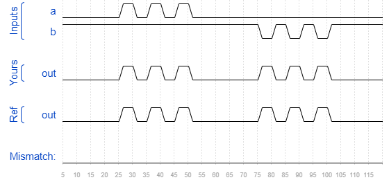

# Module
### Solution
```Verilog
module top_module ( input a, input b, output out );
    mod_a instance1(.in1(a), .in2(b), .out(out));
endmodule
```
[code](20.v)

### Timing diagrams for selected test cases

