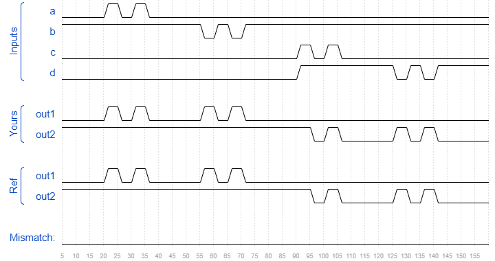

# Module
### Solution
```Verilog
module top_module ( 
    input a, 
    input b, 
    input c,
    input d,
    output out1,
    output out2
);
    mod_a MA(out1, out2, a, b, c, d);

endmodule
```
[code](./21.v)

### Timing diagrams for selected test cases

