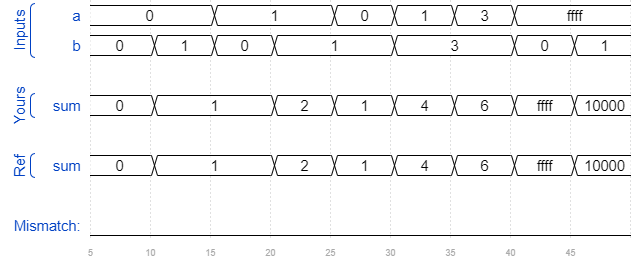

# Module add
### Solution
```Verilog
module top_module (
    input [31:0] a,
    input [31:0] b,
    output [31:0] sum
);//
    wire cout_1, cout_2;
    
    add16 ADD_1(.a(a[15:0]), .b(b[15:0]), .cin(1'b0), .sum(sum[15:0]), .cout(cout_1));
    add16 ADD_2(.a(a[31:16]), .b(b[31:16]), .cin(cout_1), .sum(sum[31:16]), .cout(cout_2));

endmodule

module add1(input a, input b, input cin, output sum, output cout);

// Full adder module here
    assign {cout, sum} = a + b + cin;

endmodule
```
[code](./26.v)

### Timing diagrams for selected test cases

