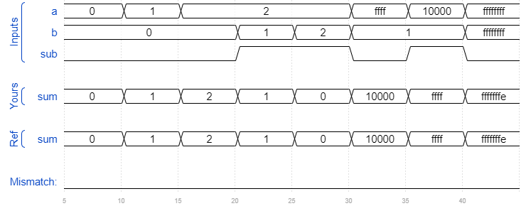

# Module addsub
### Solution
```Verilog
module top_module(
    input [31:0] a,
    input [31:0] b,
    input sub,
    output [31:0] sum
);
    wire cout_1, cout_2;
    wire [31:0] b_xor;
    
    assign b_xor = b ^ {32{sub}};
    add16 ADD_1(.a(a[15:0]), .b(b_xor[15:0]), .cin(sub), .sum(sum[15:0]), .cout(cout_1));
    add16 ADD_2(.a(a[31:16]), .b(b_xor[31:16]), .cin(cout_1), .sum(sum[31:16]), .cout(cout_2));

endmodule
```
[code](./28.v)

### Timing diagrams for selected test cases

