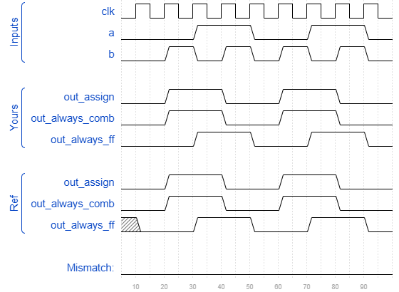

# Alwaysblock2
### Solution
```Verilog
// synthesis verilog_input_version verilog_2001
module top_module(
    input clk,
    input a,
    input b,
    output wire out_assign,
    output reg out_always_comb,
    output reg out_always_ff   );
    
    assign out_assign = a ^ b;
    
    always @(*)begin
    	out_always_comb = a ^ b;
    end
    
    always @(posedge clk)begin
    	out_always_ff <= a ^ b;
    end

endmodule
```
[code](./30.v)

### Timing diagrams for selected test cases

