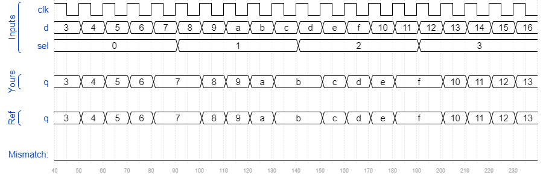

# Module shift8
### Solution
```Verilog
module top_module ( 
    input clk, 
    input [7:0] d, 
    input [1:0] sel, 
    output reg [7:0] q 
);
    wire [7:0] out1, out2, out3;
    
    my_dff8 DFF_1(.clk(clk), .d(d), .q(out1));
    my_dff8 DFF_2(.clk(clk), .d(out1), .q(out2));
    my_dff8 DFF_3(.clk(clk), .d(out2), .q(out3));
    
    always @(*) begin
        case(sel)
            2'b00 : q = d;
            2'b01 : q = out1;
            2'b10 : q = out2;
            2'b11 : q = out3;
        endcase
    end

endmodule
```
[code](./24.v)

### Timing diagrams for selected test cases

