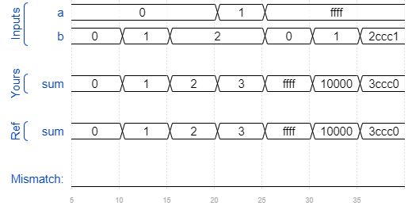

# Module cseladd
### Solution
```Verilog
module top_module(
    input [31:0] a,
    input [31:0] b,
    output reg [31:0] sum
);
    wire cout_1, cout_2, cout_3;
    wire [15:0] sum_1, sum_2;
    
    add16 ADD_1(.a(a[15:0]), .b(b[15:0]), .cin(1'b0), .sum(sum[15:0]), .cout(cout_1));
    add16 ADD_2(.a(a[31:16]), .b(b[31:16]), .cin(1'b0), .sum(sum_1), .cout(cout_2));
    add16 ADD_3(.a(a[31:16]), .b(b[31:16]), .cin(1'b1), .sum(sum_2), .cout(cout_3));
    
    always @(*) begin
        case(cout_1)
            1'b0 : sum[31:16] = sum_1;
            1'b1 : sum[31:16] = sum_2;
        endcase
    end

endmodule
```
[code](./27.v)

### Timing diagrams for selected test cases

