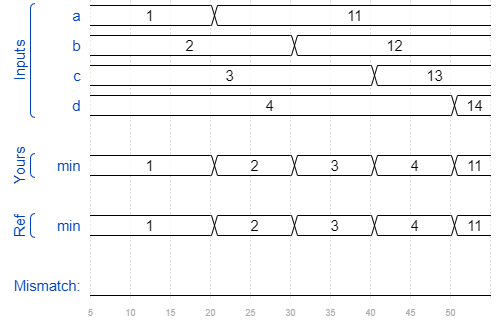

# Conditional
### Solution
```Verilog
module top_module (
    input [7:0] a, b, c, d,
    output [7:0] min);//

    wire [7:0] temp_1, temp_2;

    assign temp_1 = (a > b) ? b : a;
    assign temp_2 = (c > temp_1) ? temp_1 : c;
    assign min = (d > temp_2) ? temp_2 : d;

endmodule
```
[code](./37.v)

### Timing diagrams for selected test cases

