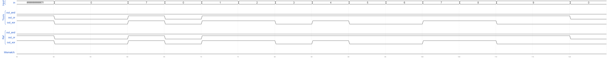

# Gates100
### Solution
```Verilog
module top_module( 
    input [99:0] in,
    output out_and,
    output out_or,
    output out_xor 
);
    
    assign out_and = & in[99:0];
    assign out_or = | in[99:0];
    assign out_xor = ^ in[99:0];

endmodule
```
[code](./39.v)

### Timing diagrams for selected test cases


