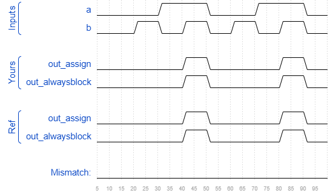

# Alwaysblock1
### Solution
```Verilog
// synthesis verilog_input_version verilog_2001
module top_module(
    input a, 
    input b,
    output wire out_assign,
    output reg out_alwaysblock
);
    assign out_assign = a & b;
    
    always @(*) begin
    	out_alwaysblock = a & b;
    end

endmodule
```
[code](./29.v)

### Timing diagrams for selected test cases

