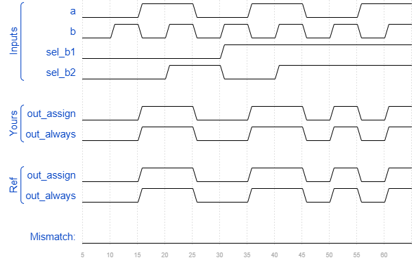

# Always if
### Solution
```Verilog
// synthesis verilog_input_version verilog_2001
module top_module(
    input a,
    input b,
    input sel_b1,
    input sel_b2,
    output wire out_assign,
    output reg out_always   ); 
    
    assign out_assign = (sel_b1 && sel_b2) ? b : a;
    
    always @(*)begin
        if(sel_b1 && sel_b2)
            out_always = b;
        else
            out_always = a;
    end

endmodule
```
[code](./31.v)

### Timing diagrams for selected test cases

