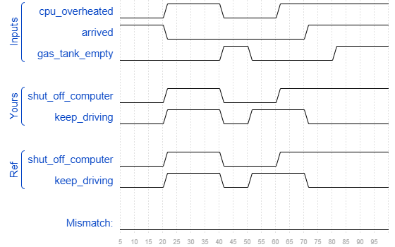

# Always if2
### Solution
```Verilog
// synthesis verilog_input_version verilog_2001
module top_module (
    input      cpu_overheated,
    output reg shut_off_computer,
    input      arrived,
    input      gas_tank_empty,
    output reg keep_driving  ); //

    always @(*) begin
        if (cpu_overheated)
        	shut_off_computer = 1;
        else
            shut_off_computer = 0;
    end

    always @(*) begin
        if (~arrived)
        	keep_driving = ~gas_tank_empty;
        else
            keep_driving = 0;
    end

endmodule
```
[code](./32.v)

### Timing diagrams for selected test cases

