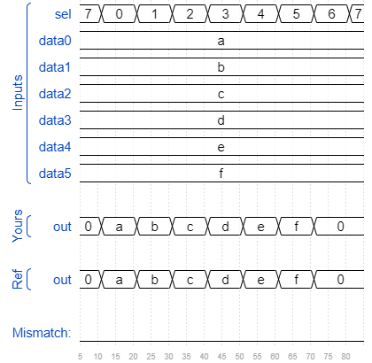

# Always case
### Solution
```Verilog
// synthesis verilog_input_version verilog_2001
module top_module ( 
    input [2:0] sel, 
    input [3:0] data0,
    input [3:0] data1,
    input [3:0] data2,
    input [3:0] data3,
    input [3:0] data4,
    input [3:0] data5,
    output reg [3:0] out   );//

    always@(*) begin  // This is a combinational circuit
        case(sel)
            3'b000 : out = data0;
            3'b001 : out = data1;
            3'b010 : out = data2;
            3'b011 : out = data3;
            3'b100 : out = data4;
            3'b101 : out = data5;
            default: out = 0;
        endcase
    end

endmodule
```
[code](./33.v)

### Timing diagrams for selected test cases

